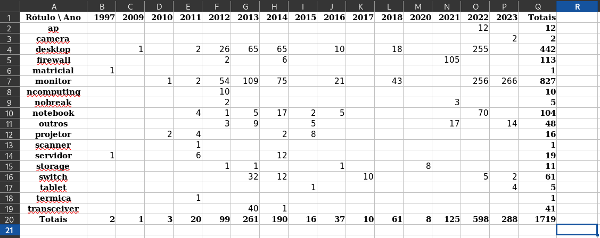

# opyxl_tst
O objetivo deste projeto é testar os recursos básicos da biblioteca **openpyxl**.

`opyxl.py` acessa os dados em um arquivo ".xlsx", processa-os e grava o resultado em outro arquivo ".xlsx".

# Origem da planilha utilizada

A planilha ".xlsx" para utilizada neste teste é enconrada na web. Não há nenhum significado específico na escolha da planilha.

Busca feita no Portal Brasileiro de Dados Abertos

- https://dados.gov.br

A planilha escolhida se encontra em:

- Empresa Mato-Grossense de Tecnologia da Informação

  - https://dados.gov.br/dados/organizacoes/visualizar/empresa-mato-grossense-de-tecnologia-da-informacao

- Bens Móveis e Imóveis

  - https://dados.gov.br/dados/conjuntos-dados/bens-moveis-e-imoveis

- XLSX - Computadores e Periféricos 2024

  - Listagem de Computadores e Periféricos de inventario 2024. 

  - Nome original da planilha: "01.xlsx"

  - Renomeada para: "equipamentos.xlsx"

# Descrição do processamento

Colunas utilizadas da planilha original:
- "Descr. Sint.": Descrição do equipamento
- "Dt.Aquisicao"
- "Quantidade"
- "Tipo Ativo"

Pré-processamento:
- Cada equipamento aparece na listagem três vezes. Para evitar essa repetição, são consideradas apenas as linhas onde o "Tipo Ativo" é vazio.
- Baseado na descrição, é criada uma classe de equipamento. Utilizando uma heurística simples são separadas algumas classes, como "monitor" e "notebook". Equipamentos não enquadrados nas classes básicas, ficam na classe "diverso".

Planilha criada:
- Apresenta totais de equipamentos adquiridos em uma grade por ano (coluna) e classe (linha)
- Apresenta formatações simples como alinhamento e negrito
- Totaliza os dados por ano e por classe

# Ambiente

Utilizando Python 3.11

Em um ambiente virtualizado, instalada a **openpyxl** com o seguinte comando:

`pip install openpyxl`

Verificação do instalado:

`pip freeze`

```
et-xmlfile==1.1.0
openpyxl==3.1.5
```

## Baixando e executando o programa

Download deste repositório

`git clone https://github.com/anselmobd/opyxl_tst.git`

Para executar o programa:

`python opyxl.py`

# Resultado

Segue uma visualização da planilha criada ao ser executado o `opyxl.py`:


